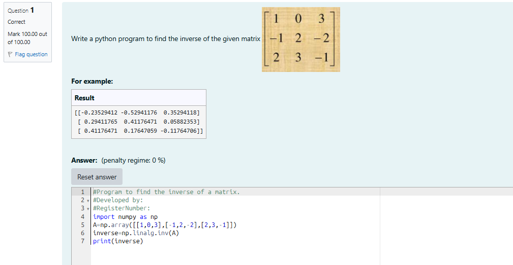

# INVERSE-OF-A-MATRIX
## Aim:
To write a python program to find the inverse of a matrix
## Equipment’s required:
1. 	Hardware – PCs
2. 	Anaconda – Python 3.7 Installation / Moodle-Code Runner
## Algorithm:
### Step1 : 
### Step 2: 
### Step 3: 
### Step 4: 

## Program:

## Output:

## Result:
Thus the inverse of given matrix is successfully solved using python program

[def]: MA3a.png